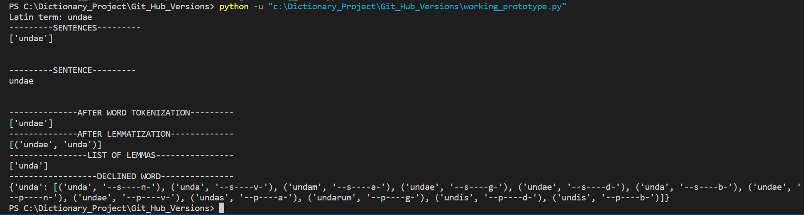

# Simple Dictionary


*The Consummation* by Thomas Cole, 1836
## Why a Latin Dictionary?
This project is a confluence of my two passions, Natural Language Processing and Latin. When reading in Latin, which is a highly inflected language, I often encounter
unfamiliar verbs and nouns, and knowing tense, gender, and case is vital to the understanding of the text. I would often use tools such as Whitaker's Words and Wiktionary, but when I travel or have a poor Internet connection, a dictionary running on my local computer would be so much more convenient. So, I decided to create my own (for now, a command-line) dictionary, which would combine the functionality of the two existing dictionaries I mentioned. I mainly rely on functionalities of CLTK (Classical Language Toolkit).

## How to Run the Dictionary

First, install CLTK. Consult this page for details: https://docs.cltk.org/en/latest/installation.html
Then, clone the project and run with the command line: ``` python latin.py ```


## Dictionary Functionality
The final version of the dictionary will have a user menu with the following options:
1) Display a Latin->English translation of the entered word
2) Display a conjugation/declension table for the entered word/sentence
3) Display both the table and the translation
0) Quit the program

A user will be prompted to enter a Latin term or sentence. Then, the menu described above will appear and by pressing 1, 2, 3, or 0 on the keyboard, the user can choose the option he needs.

(The "Progress" paragraph below discusses the current stage the project is in)

## Progress
**October 19, 2022:** Uploaded the first working prototype! In this first version, I implemented the 2nd option from the user menu, which is a conjugation/declension table. (The comments in the output are for my understanding and easier debugging. I will, of course, remove them for the final version)

Entering a noun "undae", which means "of a wave":


Entering a verb "petivit", which means "He/she aims at":


(This is not an entire table, but I think this will suffice for a visual example!)

I wanted to include these visuals of a noun and a verb to show the dictionary's functionality in the most simple case, but below we will take a look at a sentence.

A user wants to see declension/ conjugation tables for her favorite quote by Seneca: "Veritas numquam perit". 

First, the program will remove any non-Latin characters, such as commas and periods (yes, the user added weird punctuation to prove a point). The clean sentence is displayed under the "SENTENCES" comment. Then, we take the only element in the list, because we want to be working with a string. Under the "SENTENCE" header, the sentence displayed has a string type. The rest of the headers are quite self-explanatory. The goal is now to break the sentence into even smaller pieces, or "tokens", where each word is a token. Then, the lemmatization step is very important; it extracts the canonical form of the word from its declined version and puts the original word and its lemma in a pair. Then, we only work with a list of lemmas, from which we derive the conjugation table.


**November 1, 2022** Uploaded prototype 2.0, which now has a quaint user menu, that allows the user to choose between several options. 


(after this, the word "acer" is conjugated, using the same process from the above scrrenshots)
For #1, I tested with a static string "acer", which happens to be in my testing-size Latin to English dictionary (latin_to_english.txt). The output is the line number on which the word occured and the actual translation. The next step for #1 would be to extract the dictionary form of the word the user entered and passing it to the function instead of the hardcoded "acer". To achieve this, tokenization and lemmatization functionality must be encapsulated, because even if the user does not need to see the declension/conjugation table, the process must still run on the backround to extract the dictionary form of the word. This part successfully works.

For #2, I did not add much, because I already had the functionality implemented. The only change thtat I made is that I made the executing of this code conditional, as opposed to the last prototype, which did not have user options

For #3, I will only need to add another conditional to the two previous cases. I have not done this part yet becuase I want to ensure that #1 and #2 work first.

**November 2, 2022** Uploaded prototype 3.0 -- a fully functioning final draft. All options are now implemented, as will be demostrated below. The only two additions I still have to make is adding a loop to continue asking the user to enter new terms and add a "quit" option. As of now, the program executes only once. I also kept all prints to see that tokens and lemmas are correct, but this information is redundant for the user, so I will remove it from the final version. Also, I will have to find a complete Latin->English dictionary, as opposed to the small testing one I have.

Menu & option #1:


Option #2


Option #3


**November 2, 2022** Now, the program loops back, asking user for a new option, until he presses 0 to quit.


**November 7, 2022** In this version, I made declension/conjugation output human-readable, as opposed to just printing a list structure.


## A Word on u/v and i/j
In Latin, letters "u" and "v" are often being used interchangeably, as well as "i" and "j". When working with a large text, it is important to standardize data, and change all "v" characters to "u" and all "j" characters to "i". When I first started familiarizing myself with CLTK, I took a Latin text and standardized it by changing the aforementioned letters to fit a single standard with the help of JVReplacer(). However, my dictionary works with a user's input, which is later processed by many other functions which do not need the text to be standardized. In fact, this kind of standardization can render a word unrecognizable. For instance, the function can recognize the word for "door", which is "janua", but would have trouble recognizing the less common spelling "ianua". Also, the word "wine", or "vinum" would not be recognized if it was spelled as "uinum". Ultimately, if there is a large text that needs to be standardized for further analysis, being consistent with the transcription is crucial, but when the goal is to translate a word or a short sentence, it is best to rely on the most common spelling.
## References & Resources Utilized
- https://legacy.cltk.org/en/latest/latin.html -- I used this great resource to familiarize myself with CLTK and understand the sequence of steps taken to work with data
- https://www.youtube.com/watch?v=OtxC44b1rws&list=PL2VXyKi-KpYuKYUkf1aODP4vHpOh7yvjr -- I mostly relied on this amazing series of tutorials on the CLTK library and an overall methods used for data preparation in CLTK
- https://docs.cltk.org/en/latest/ -- this is the best source for general guidance on using CLTK
